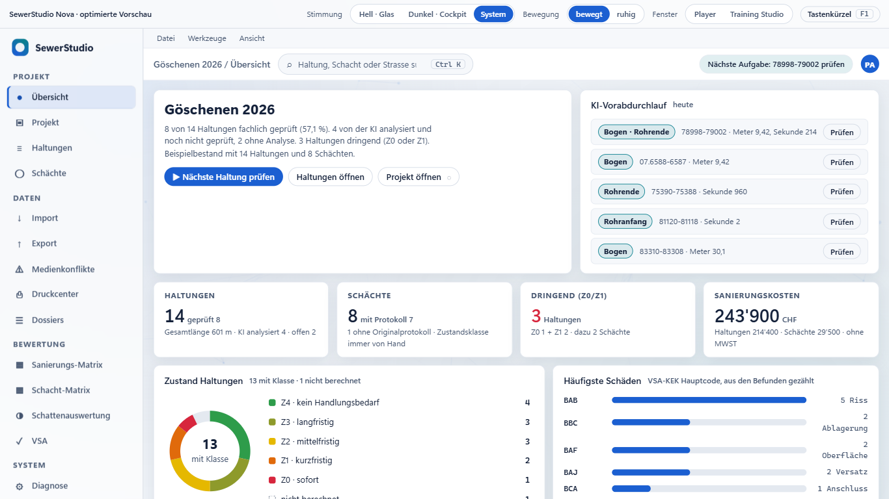
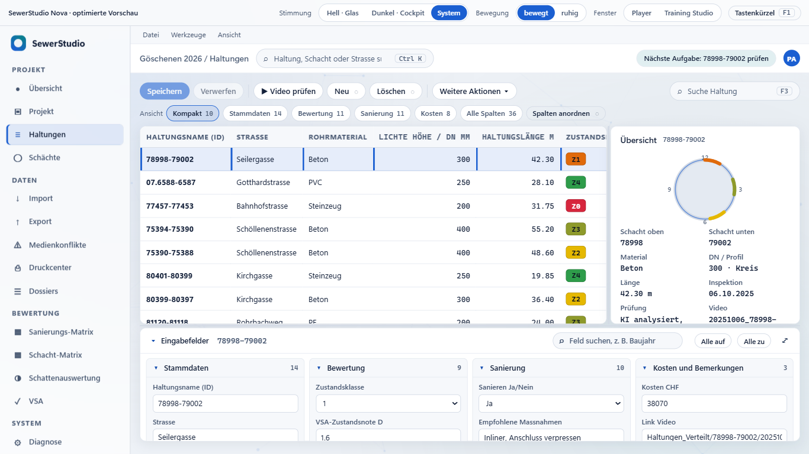
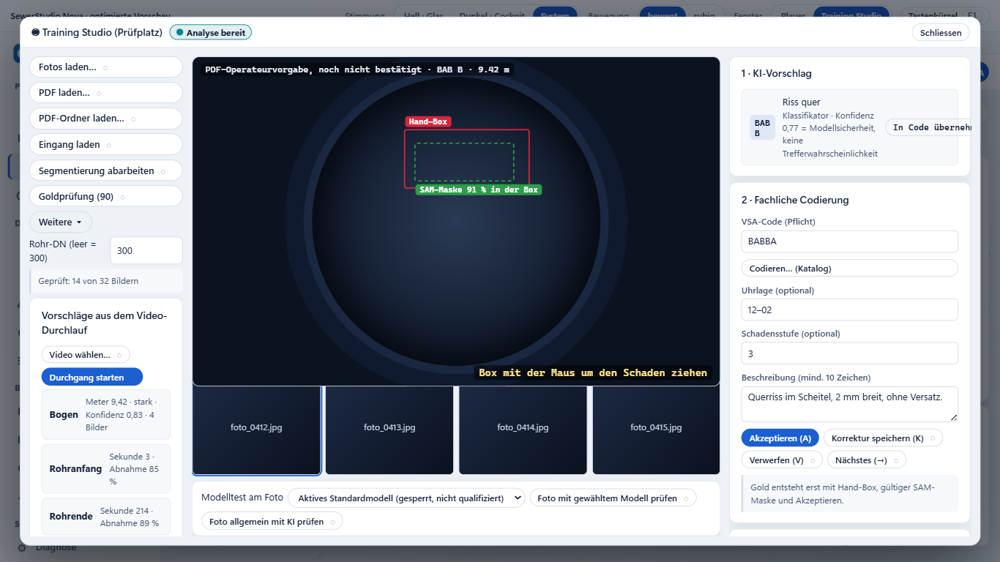
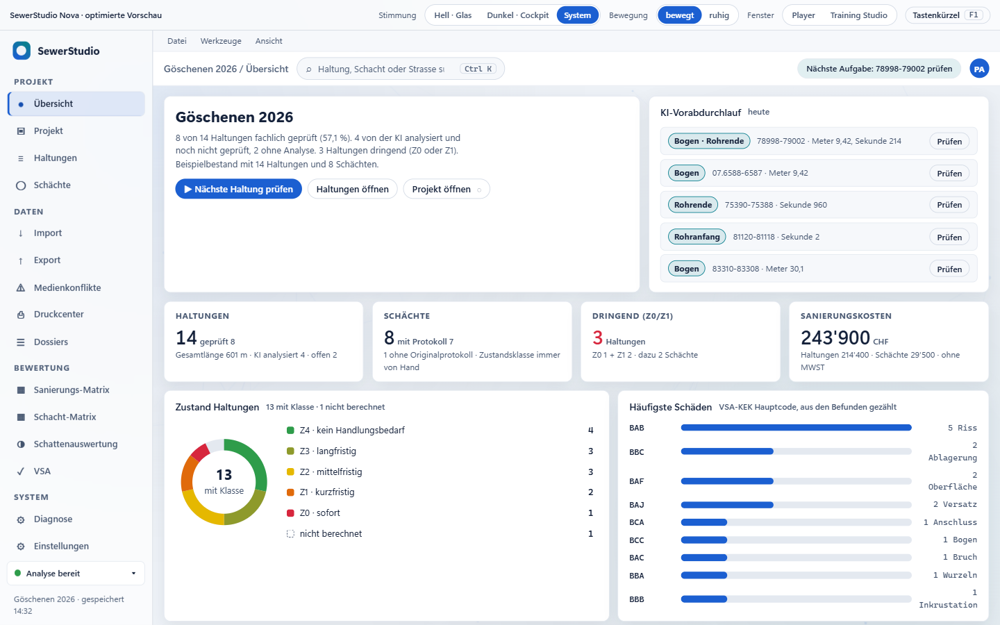
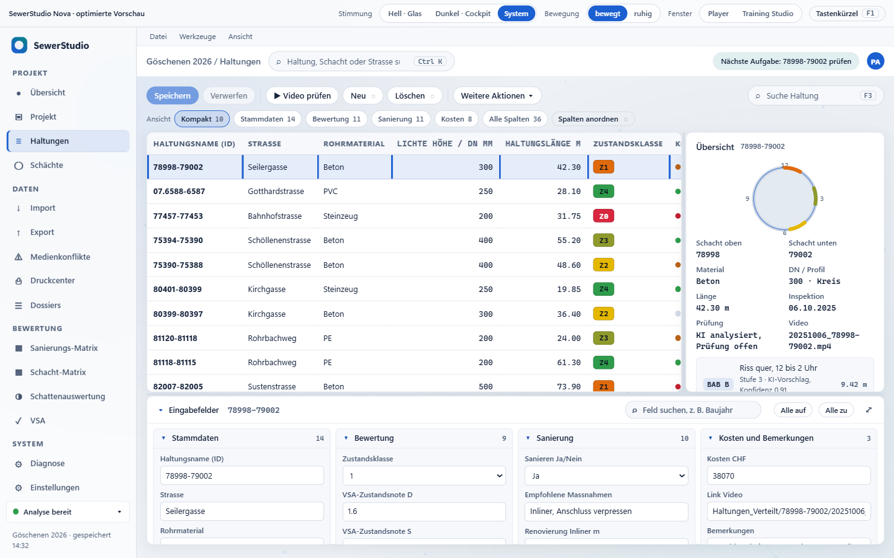
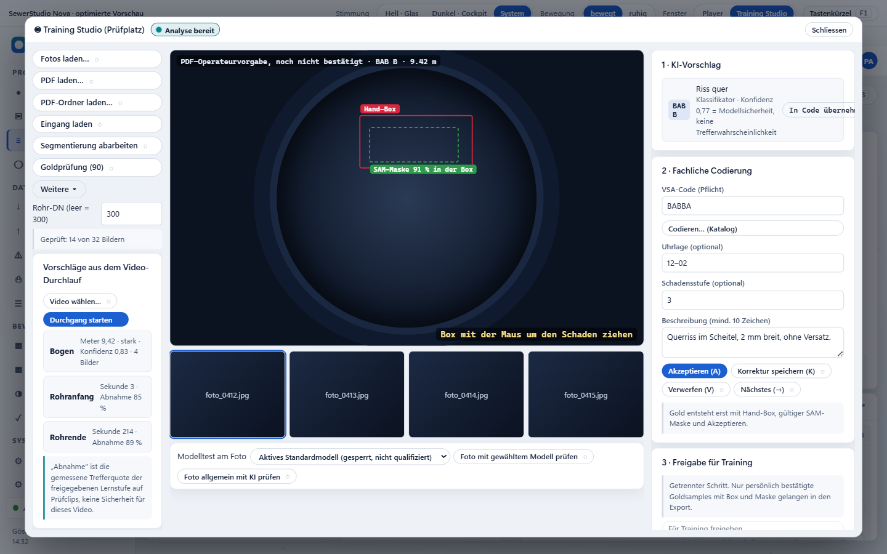
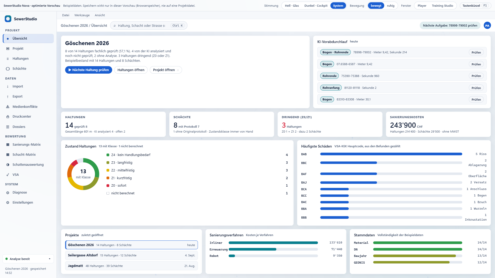
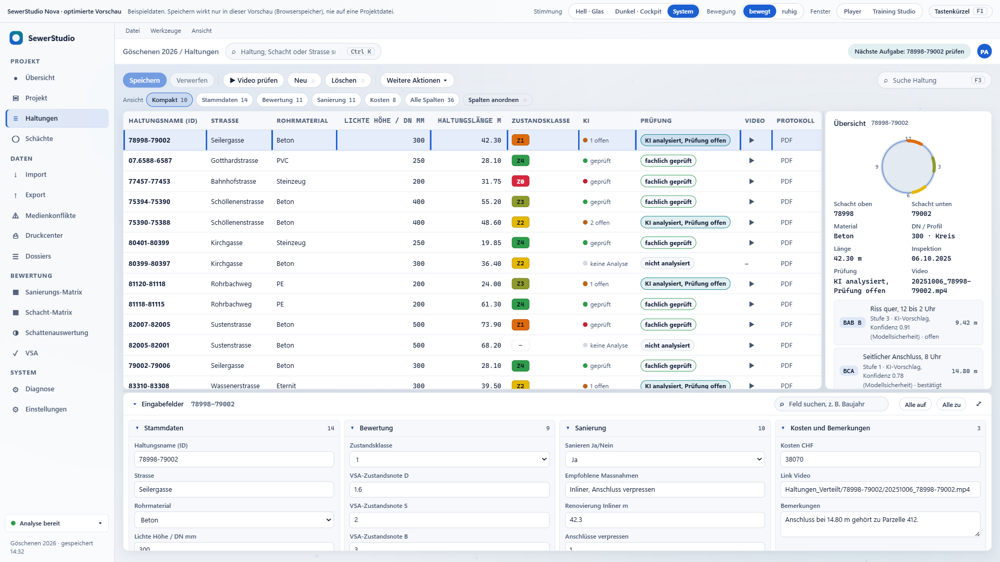
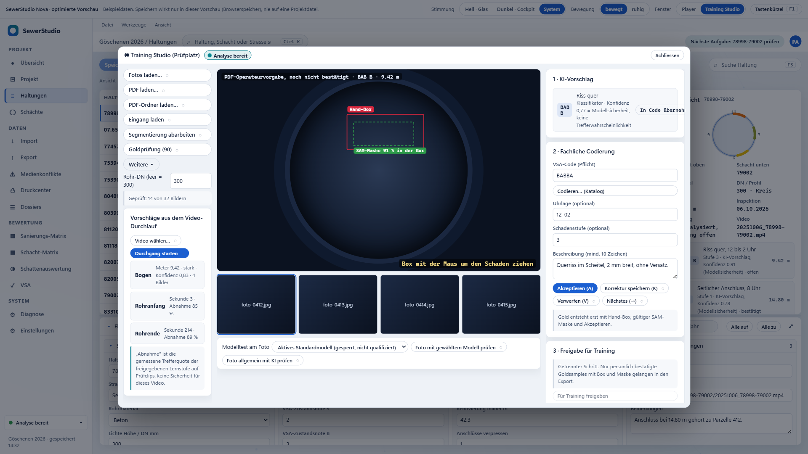

# Prüftabelle: SewerStudio-Nova-Optimiert.html

Stand 2026-09-06. Automatisch mit Chromium (Playwright) ausgeführt, Skript `nachweise/pruefung.js`, Rohergebnis `nachweise/pruefergebnis.json`. Jeder Punkt ist als bestanden, fehlgeschlagen oder nicht geprüft gekennzeichnet. Was hier nicht steht, wurde nicht geprüft.

**Ergebnis: 62 bestanden, 0 fehlgeschlagen, 0 nicht geprüft.**

## Grundlagen, Seiten und Fenster

| Nr. | Prüfpunkt | Ergebnis | Beleg |
|---|---|---|---|
| A1 | Dokument: DOCTYPE, UTF-8, lang=de, viewport | bestanden | CSS1Compat UTF-8 |
| A2 | Keine externen Schriften oder Skripte | bestanden | Systemschriften Segoe UI / Cascadia Mono |
| A3 | Umlaute im lokalen Aufruf lesbar | bestanden | 8 von 14 Haltungen fachlich geprüft (57,1 %). 4 von der KI a |
| A4 | Alle 15 Seiten über die Navigation erreichbar | bestanden | 15 von 15 |
| A5 | Drei Fenster öffnen: Player, Training Studio, VSA-Codierung | bestanden | true/true/true |
| A6 | Keine Skriptfehler beim Durchklicken | bestanden | keine |

## Datensatzwechsel, Speichern, Verwerfen, Abbrechen

| Nr. | Prüfpunkt | Ergebnis | Beleg |
|---|---|---|---|
| B1 | Wechsel auf 07.6588-6587: Formular, Übersicht und Medien folgen | bestanden | {"material":"PVC","dn":"250","laenge":"28.1","video":true} |
| B2 | Zurück auf 78998-79002: Beton, 300, 42.30 | bestanden | {"material":"Beton","dn":"300","laenge":"42.3"} |
| B3 | Ungespeicherte Änderung sichtbar (Badge, Zeilenmarke, Speichern aktiv) | bestanden | badge true save true mark true |
| B4 | Wechsel bei Änderungen fragt nach; Abbrechen bleibt auf der Haltung | bestanden | dialog true role alertdialog bleibt true |
| B5 | Verwerfen und wechseln: Ziel gewählt, Ursprung unverändert | bestanden | jetzt 07.6588-6587 true, Baujahr h01 = 1978 |
| B6 | Speichern und wechseln: Wert im Bestand, Ziel gewählt | bestanden | Baujahr h02 = 1995 |
| B7 | Gespeicherter Wert überlebt Neuladen (Browserspeicher, kein Projektschreiben) | bestanden | nach Neuladen 1995 |
| B8 | Verwerfen ohne Wechsel setzt Feld zurück | bestanden |  |

## Unabhängige Suchen

| Nr. | Prüfpunkt | Ergebnis | Beleg |
|---|---|---|---|
| C1 | Feldsuche „Baujahr" bei Haltungen lässt Schachtfelder unberührt | bestanden | Schachtfelder 30 → 30, Haltungsfelder sichtbar: Baujahr |
| C2 | Ansichtswechsel bei Haltungen ändert Schachtansicht und Schachtauswahl nicht | bestanden | Schacht s01→s01, Ansicht S: Kompakt 9 |
| C3 | „Alle zu" wirkt nur auf die eigene Seite | bestanden | S offen true, H offen false |
| C4 | Schachtsuche arbeitet eigenständig | bestanden | Schächte 1, Haltungen 14 |
| C5 | Feldsuche bei Schächten lässt Haltungsfelder unberührt | bestanden | S 1, H 36 |

## Korrekte Summen

| Nr. | Prüfpunkt | Ergebnis | Beleg |
|---|---|---|---|
| D1 | Dringend = Z0 + Z1 | bestanden | 3 = 1 + 2 |
| D2 | Legende summiert auf die Gesamtzahl | bestanden | 14 = 14 |
| D3 | Prozent mit Zähler und Nenner, korrekt gerundet | bestanden | 8 von 14 Haltungen fachlich geprüft (57,1 %). 4 vo |
| D4 | Kosten-KPI = Summe Haltungen + Schächte | bestanden | 243'900CHF |
| D5 | Text unterscheidet fachlich geprüft, KI analysiert und ohne Analyse | bestanden |  |

## Ablauf: nächste Haltung, Player, Codierung, Rückkehr

| Nr. | Prüfpunkt | Ergebnis | Beleg |
|---|---|---|---|
| E1 | „Nächste Haltung prüfen" wählt eine offene Haltung und öffnet den Player | bestanden | h01 78998-79002 · 20251006_78998-79002.mp4 (analysiert) |
| E2 | Player: Dialogrolle, aria-modal, Name, Fokus im Dialog | bestanden | focus true role dialog |
| E3 | Ereignis erfassen → Abbrechen: kehrt zum Player zurück, nichts übernommen, Position gleich | bestanden | {"vsa":false,"player":true,"pos":202,"n":3,"focus":"plNewEvent"} |
| E4 | Ereignis erfassen → Übernehmen: Befund gespeichert, Player offen, Haltung und Position erhalten | bestanden | {"vsa":false,"player":true,"pos":202,"n":4,"id":"h01","sel":"h01"} Fehlerhinweis bei Ende<Start: true |
| E5 | Esc schliesst den Player; Fokus kehrt zum Auslöser oder, wenn der unsichtbar ist, zur gewählten Zeile | bestanden | focus h01 |
| E6 | Training Studio → Katalog → Übernehmen: Code im Studio, Studio bleibt offen | bestanden | {"studio":true,"vsa":false,"code":"BBCA","focus":"stCatalog"} |
| E7 | Studio: Vorschlag, Bestätigung und Trainingsfreigabe sind getrennte Schritte | bestanden | Freigabe erst nach Akzeptieren aktiv |

## Ruhiger Modus

| Nr. | Prüfpunkt | Ergebnis | Beleg |
|---|---|---|---|
| F1 | „Ruhig" stoppt die Hintergrund-Engine (Canvas unverändert, Schleife aus) | bestanden | vorher läuft true, nachher false, Canvas gleich true |
| F2 | Wahl „ruhig" bleibt nach Neuladen erhalten | bestanden |  |
| F3 | Engine pausiert, solange ein Fenster die Ansicht verdeckt | bestanden | sichtbar true, bei Dialog false |
| F4 | Systemeinstellung „Bewegung reduzieren" stoppt Engine und Pulsanimation auch bei „bewegt" | bestanden | engine false, animation none |

## Tastaturbedienung und Dialoge

| Nr. | Prüfpunkt | Ergebnis | Beleg |
|---|---|---|---|
| G1 | Enter auf Navigationseintrag Export öffnet die Exportseite | bestanden |  |
| G2 | Ctrl+K, Suchtext, Enter: springt zur gefundenen Haltung | bestanden | {"page":"page-haltungen","sel":"h10"} Treffer 2 |
| G3 | F3 fokussiert die Haltungssuche | bestanden |  |
| G4 | Pfeiltasten und Enter wählen Zeilen in der Liste | bestanden | h02 |
| G5 | F1 öffnet Tastenkürzel, Fokus bleibt im Dialog, Esc schliesst | bestanden |  |
| G6 | Jede Schaltfläche hat Text, aria-label oder Titel | bestanden | 0 ohne Bezeichnung |
| G7 | Sichtbarer Tastaturfokus definiert | bestanden |  |

## Arbeitsfläche in 1366 × 768, 1440 × 900, 1920 × 1080

| Nr. | Prüfpunkt | Ergebnis | Beleg |
|---|---|---|---|
| H-1366 | 1366×768: mindestens sechs Haltungen sichtbar, Eingabefelder und Übersicht im Bild | bestanden | 7 Zeilen sichtbar, Eingabefelder true, Übersicht true |
| HP-1366 | 1366×768: Player zeigt Wiedergabe, Zeit, Übernehmen und Seitenspalte ohne Scrollen | bestanden | {"play":true,"time":true,"apply":true,"side":true,"sideW":338.2401428222656} |
| HS-1366 | 1366×768: Training Studio: Codier- und Freigabespalte vollständig erreichbar | bestanden | {"colInView":true,"colW":330,"releaseReachable":true,"acceptVisibleAtTop":true} |
| H-1440 | 1440×900: mindestens sechs Haltungen sichtbar, Eingabefelder und Übersicht im Bild | bestanden | 9 Zeilen sichtbar, Eingabefelder true, Übersicht true |
| HP-1440 | 1440×900: Player zeigt Wiedergabe, Zeit, Übernehmen und Seitenspalte ohne Scrollen | bestanden | {"play":true,"time":true,"apply":true,"side":true,"sideW":338.2401428222656} |
| HS-1440 | 1440×900: Training Studio: Codier- und Freigabespalte vollständig erreichbar | bestanden | {"colInView":true,"colW":330,"releaseReachable":true,"acceptVisibleAtTop":true} |
| H-1920 | 1920×1080: mindestens sechs Haltungen sichtbar, Eingabefelder und Übersicht im Bild | bestanden | 12 Zeilen sichtbar, Eingabefelder true, Übersicht true |
| HP-1920 | 1920×1080: Player zeigt Wiedergabe, Zeit, Übernehmen und Seitenspalte ohne Scrollen | bestanden | {"play":true,"time":true,"apply":true,"side":true,"sideW":338.2401428222656} |
| HS-1920 | 1920×1080: Training Studio: Codier- und Freigabespalte vollständig erreichbar | bestanden | {"colInView":true,"colW":330,"releaseReachable":true,"acceptVisibleAtTop":true} |

## Schriftgrösse und Kontrast

| Nr. | Prüfpunkt | Ergebnis | Beleg |
|---|---|---|---|
| I1-hell | Schriftgrösse hell: kleinster sichtbarer Text ≥ 11 px (Beschriftungen 12 bis 13, Daten 13 bis 15) | bestanden | kleinste 11 px (overview: kbd) |
| I2-hell | Kontrast hell: sichtbarer Text mindestens 4,5:1 | bestanden | 1129 Textelemente geprüft, schwächster 4.95:1 (haltungen: SMALL „10") |
| I1-dunkel | Schriftgrösse dunkel: kleinster sichtbarer Text ≥ 11 px (Beschriftungen 12 bis 13, Daten 13 bis 15) | bestanden | kleinste 11 px (overview: kbd) |
| I2-dunkel | Kontrast dunkel: sichtbarer Text mindestens 4,5:1 | bestanden | 1129 Textelemente geprüft, schwächster 5.2:1 (overview: val „3Haltungen") |

## Ehrlicher Prototyp

| Nr. | Prüfpunkt | Ergebnis | Beleg |
|---|---|---|---|
| J1 | Export nennt Ziel und Ergebnis und sagt, dass keine Datei geschrieben wurde | bestanden | Nur Vorschau: es wurde keine Datei geschrieben.VorgangHaltungen.xlsxZiel im Prog |
| J2 | Revidierte XTF wird vom GEONIS-Rückabgleich unterschieden | bestanden |  |
| J3 | Nicht umgesetzte Aktionen sind gekennzeichnet und erklären sich | bestanden | 181 Aktionen mit Kennzeichnung ◌ |
| J4 | Leerzustand erscheint, wenn ein Filter keine Fälle hat | bestanden |  |
| J5 | Lade- und Erfolgszustand (Schattenlauf) sichtbar und als Simulation benannt | bestanden |  |
| J6 | KI-Prozentwerte werden als Modellsicherheit erklärt; Bestätigung getrennt | bestanden |  |
| J7 | Skriptfehler im gesamten Lauf | bestanden | keine |

## Bildschirmbilder

Alle unter `nachweise/`: Übersicht, Haltungen, Player und Training Studio je in 1366 × 768, 1440 × 900 und 1920 × 1080 (hell), dazu Übersicht und Haltungen dunkel in 1440 × 900.

| Grösse | Übersicht | Haltungen | Training Studio |
|---|---|---|---|
| 1366 × 768 |  |  |  |
| 1440 × 900 |  |  |  |
| 1920 × 1080 |  |  |  |

## Nicht geprüft

- Windows-Skalierung 125 % und 150 % in der echten WPF-Anwendung.
- Screenreader-Ausgabe. Geprüft wurden nur Rollen, Namen, Fokus und Tastatur im Browser.
- Echte Importe, Exporte, Modelle und Projektdateien. Der Prototyp berührt keine davon.
- Ein vollständiger WCAG-Konformitätstest. Gemessen wurde der Textkontrast aller sichtbaren Textelemente auf sechs Seiten je Thema.
- Optische Bewertung durch den Fachanwender.

## Originale unverändert

- `SewerStudio-Nova-Komplett.html` SHA-256 `d7fccf0ca4d74c7db3f23c7c041a68b703faf265e3b44d6ba4846583bd84a61e` (Desktop, nicht angefasst)
- `SewerStudio-Nova-Vorschau.html` SHA-256 `a8132f5372012c2332131221a517a1927ed552f0aa434e4b0a95d03eac6242f6` (Desktop, nicht angefasst)
