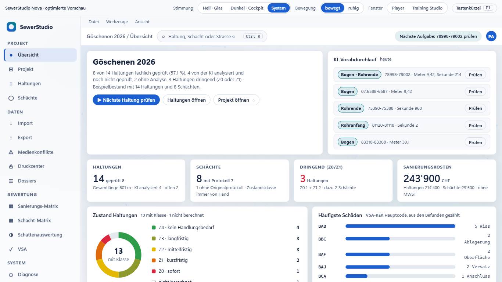
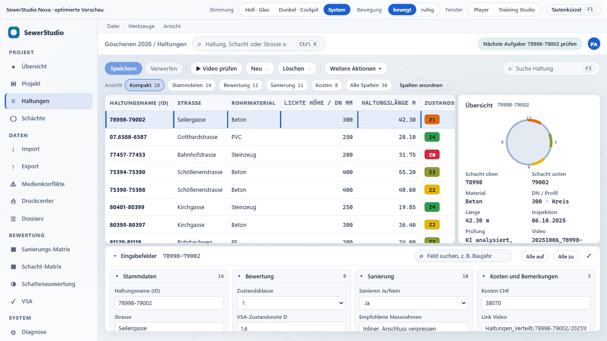
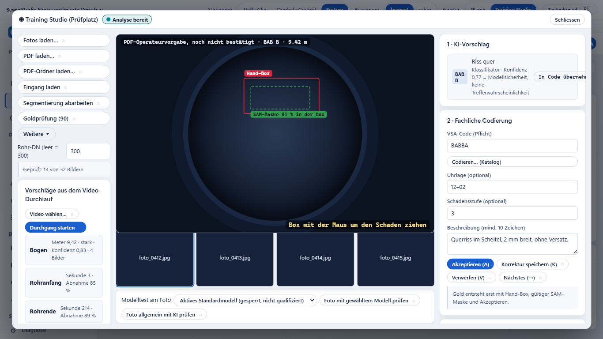
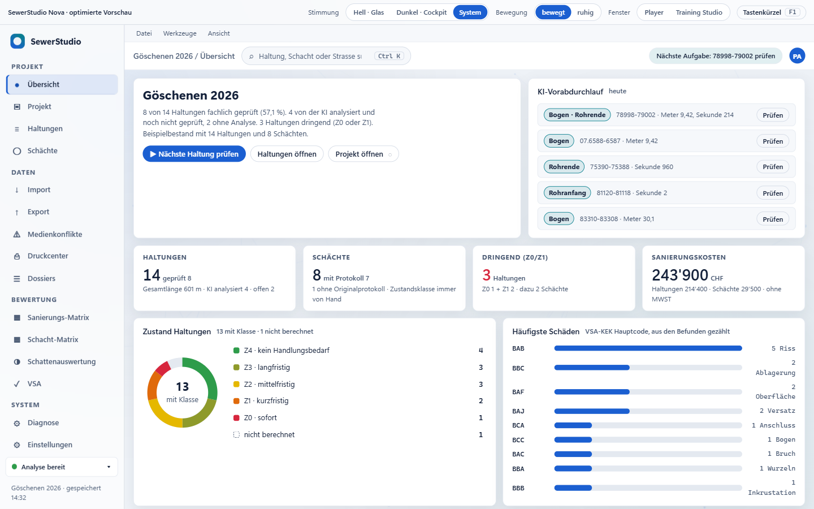
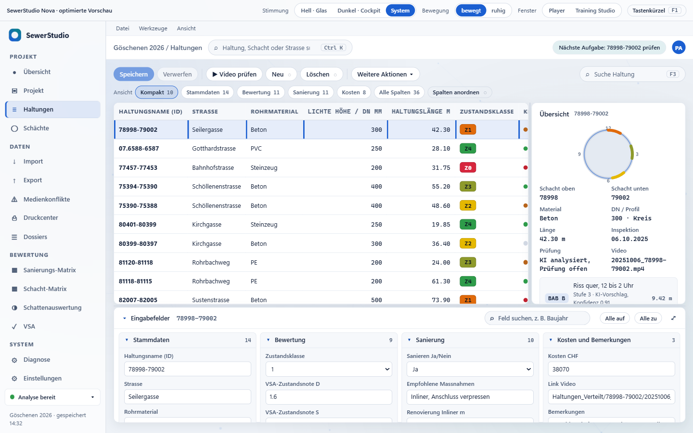
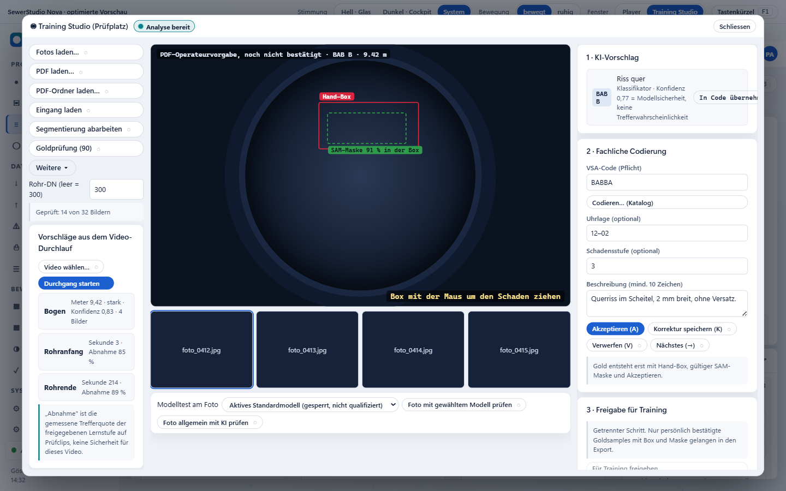
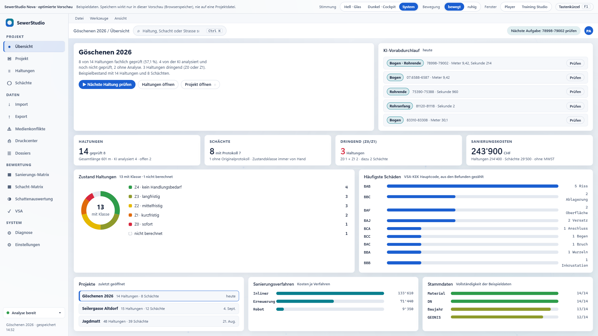
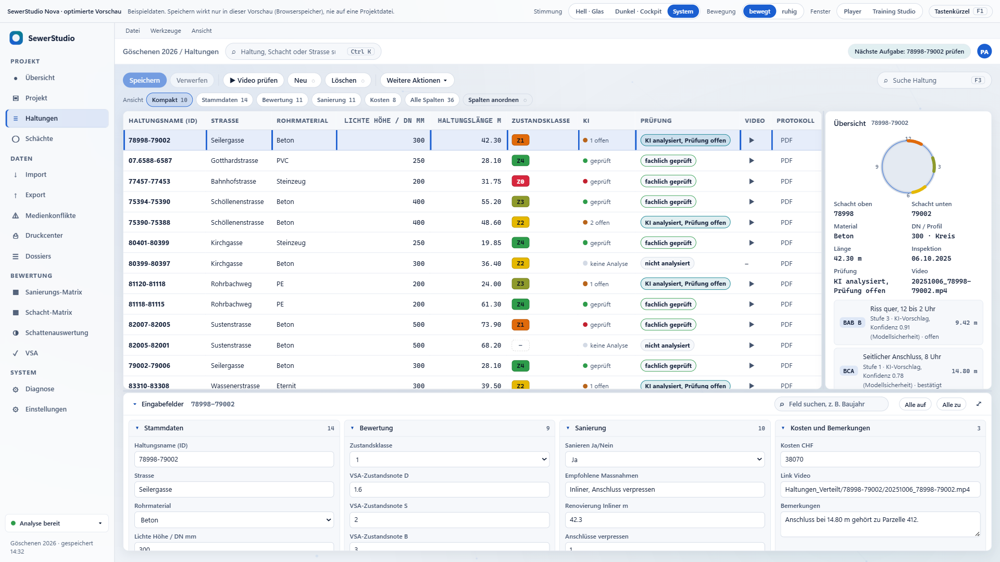
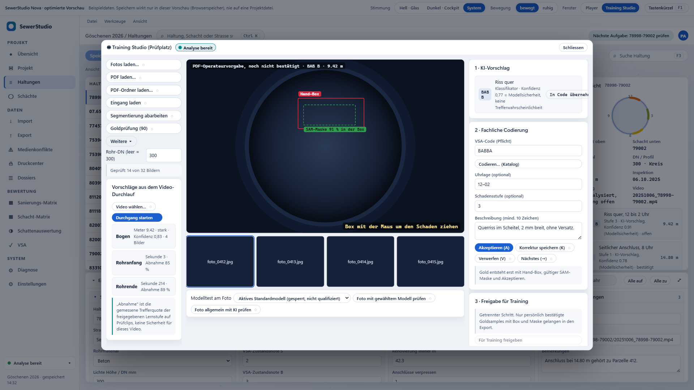

# Prüftabelle: SewerStudio-Nova-Optimiert-v2.html

Stand 2026-09-06. Automatisch mit Chromium (Playwright) ausgeführt: eigener Lauf `nachweise/pruefung-v2.js` (Rohergebnis `nachweise/pruefergebnis.json`, Konsole `nachweise/lauf-v2.log`) und die Codex-Gegenproben (`nachweise/gegenproben-lauf.js`, Ergebnis `nachweise/gegenpruefung-v2.json`). Jeder Punkt ist bestanden, fehlgeschlagen oder nicht geprüft. Was hier nicht steht, wurde nicht geprüft.

**Eigener Lauf: 80 bestanden, 0 fehlgeschlagen, 2 nicht geprüft.** Die zwei nicht geprüften Punkte (I4) sind reine Berichte über Texte auf Verläufen; in v2 gibt es keine solchen Stellen mehr.

## Grundlagen, Seiten und Fenster

| Nr. | Prüfpunkt | Ergebnis | Beleg |
|---|---|---|---|
| A1 | Dokument: DOCTYPE, UTF-8, lang=de, viewport | bestanden | CSS1Compat UTF-8 |
| A2 | Keine externen Schriften oder Skripte | bestanden | Systemschriften Segoe UI / Cascadia Mono |
| A3 | Umlaute im lokalen Aufruf lesbar | bestanden | 8 von 14 Haltungen fachlich geprüft (57,1 %). 4 von der KI a |
| A4 | Alle 15 Seiten über die Navigation erreichbar | bestanden | 15 von 15 |
| A5 | Drei Fenster öffnen: Player, Training Studio, VSA-Codierung | bestanden | true/true/true |
| A6 | Keine Skriptfehler beim Durchklicken | bestanden | keine |

## Datensatzwechsel, Speichern, Verwerfen, Abbrechen

| Nr. | Prüfpunkt | Ergebnis | Beleg |
|---|---|---|---|
| B1 | Wechsel auf 07.6588-6587: Formular, Übersicht und Medien folgen | bestanden | {"material":"PVC","dn":"250","laenge":"28.1","video":true} |
| B2 | Zurück auf 78998-79002: Beton, 300, 42.30 | bestanden | {"material":"Beton","dn":"300","laenge":"42.3"} |
| B3 | Ungespeicherte Änderung sichtbar (Badge, Zeilenmarke, Speichern aktiv) | bestanden | badge true save true mark true |
| B4 | Wechsel bei Änderungen fragt nach; Abbrechen bleibt auf der Haltung | bestanden | dialog true role alertdialog bleibt true |
| B5 | Verwerfen und wechseln: Ziel gewählt, Ursprung unverändert | bestanden | jetzt 07.6588-6587 true, Baujahr h01 = 1978 |
| B6 | Speichern und wechseln: Wert im Bestand, Ziel gewählt | bestanden | Baujahr h02 = 1995 |
| B7 | Gespeicherter Wert überlebt Neuladen (Browserspeicher, kein Projektschreiben) | bestanden | nach Neuladen 1995 |
| B8 | Verwerfen ohne Wechsel setzt Feld zurück | bestanden |  |

## Unabhängige Suchen

| Nr. | Prüfpunkt | Ergebnis | Beleg |
|---|---|---|---|
| C1 | Feldsuche „Baujahr" bei Haltungen lässt Schachtfelder unberührt | bestanden | Schachtfelder 30 → 30, Haltungsfelder sichtbar: Baujahr |
| C2 | Ansichtswechsel bei Haltungen ändert Schachtansicht und Schachtauswahl nicht | bestanden | Schacht s01→s01, Ansicht S: Kompakt 9 |
| C3 | „Alle zu" wirkt nur auf die eigene Seite | bestanden | S offen true, H offen false |
| C4 | Schachtsuche arbeitet eigenständig | bestanden | Schächte 1, Haltungen 14 |
| C5 | Feldsuche bei Schächten lässt Haltungsfelder unberührt | bestanden | S 1, H 36 |

## Korrekte Summen

| Nr. | Prüfpunkt | Ergebnis | Beleg |
|---|---|---|---|
| D1 | Dringend = Z0 + Z1 | bestanden | 3 = 1 + 2 |
| D2 | Legende summiert auf die Gesamtzahl | bestanden | 14 = 14 |
| D3 | Prozent mit Zähler und Nenner, korrekt gerundet | bestanden | 8 von 14 Haltungen fachlich geprüft (57,1 %). 4 vo |
| D4 | Kosten-KPI = Summe Haltungen + Schächte | bestanden | 243'900CHF |
| D5 | Text unterscheidet fachlich geprüft, KI analysiert und ohne Analyse | bestanden |  |

## Ablauf: nächste Haltung, Player, Codierung, Rückkehr

| Nr. | Prüfpunkt | Ergebnis | Beleg |
|---|---|---|---|
| E1 | „Nächste Haltung prüfen" wählt eine offene Haltung und öffnet den Player | bestanden | h01 78998-79002 · 20251006_78998-79002.mp4 (analysiert) |
| E2 | Player: Dialogrolle, aria-modal, Name, Fokus im Dialog | bestanden | focus true role dialog |
| E3 | Ereignis erfassen → Abbrechen: kehrt zum Player zurück, nichts übernommen, Position gleich | bestanden | {"vsa":false,"player":true,"pos":202,"n":3,"focus":"plNewEvent"} |
| E4 | Ereignis erfassen → Übernehmen: Befund im Player-Entwurf, Bestand noch unverändert, Player offen, Haltung und Position erhalten | bestanden | {"vsa":false,"player":true,"pos":202,"n":4,"bestand":3,"id":"h01","sel":"h01"} Fehlerhinweis bei Ende<Start: true |
| E5 | Esc bei Entwurf fragt nach; Verwerfen schliesst den Player; Fokus kehrt zum Auslöser oder zur gewählten Zeile | bestanden | focus h01 |
| E6 | Training Studio → Katalog → Übernehmen: Code im Studio, Studio bleibt offen | bestanden | {"studio":true,"vsa":false,"code":"BBCA","focus":"stCatalog"} |
| E7 | Studio: Vorschlag, Bestätigung und Trainingsfreigabe sind getrennte Schritte | bestanden | Freigabe erst nach Akzeptieren aktiv |

## Ruhiger Modus

| Nr. | Prüfpunkt | Ergebnis | Beleg |
|---|---|---|---|
| F1 | „Ruhig" stoppt die Hintergrund-Engine (Canvas unverändert, Schleife aus) | bestanden | vorher läuft true, nachher false, Canvas gleich true |
| F2 | Wahl „ruhig" bleibt nach Neuladen erhalten | bestanden |  |
| F3 | Engine pausiert, solange ein Fenster die Ansicht verdeckt | bestanden | sichtbar true, bei Dialog false |
| F4 | Systemeinstellung „Bewegung reduzieren" stoppt Engine und Pulsanimation auch bei „bewegt" | bestanden | engine false, animation none |

## Tastaturbedienung und Dialoge

| Nr. | Prüfpunkt | Ergebnis | Beleg |
|---|---|---|---|
| G1 | Enter auf Navigationseintrag Export öffnet die Exportseite | bestanden |  |
| G2 | Ctrl+K, Suchtext, Enter: springt zur gefundenen Haltung | bestanden | {"page":"page-haltungen","sel":"h10"} Treffer 2 |
| G3 | F3 fokussiert die Haltungssuche | bestanden |  |
| G4 | Pfeiltasten und Enter wählen Zeilen in der Liste | bestanden | h02 |
| G5 | F1 öffnet Tastenkürzel, Fokus bleibt im Dialog, Esc schliesst | bestanden |  |
| G6 | Jede Schaltfläche hat Text, aria-label oder Titel | bestanden | 0 ohne Bezeichnung |
| G7 | Sichtbarer Tastaturfokus definiert | bestanden |  |

## Arbeitsfläche in 1366 × 768, 1440 × 900, 1920 × 1080

| Nr. | Prüfpunkt | Ergebnis | Beleg |
|---|---|---|---|
| H-1366 | 1366×768: mindestens sechs Haltungen sichtbar, Eingabefelder und Übersicht im Bild | bestanden | 7 Zeilen sichtbar, Eingabefelder true, Übersicht true |
| HP-1366 | 1366×768: Player zeigt Wiedergabe, Zeit, Übernehmen und Seitenspalte ohne Scrollen | bestanden | {"play":true,"time":true,"apply":true,"side":true,"sideW":338.2401428222656} |
| HS-1366 | 1366×768: Training Studio: Codier- und Freigabespalte vollständig erreichbar | bestanden | {"colInView":true,"colW":330,"releaseReachable":true,"acceptVisibleAtTop":true} |
| H-1440 | 1440×900: mindestens sechs Haltungen sichtbar, Eingabefelder und Übersicht im Bild | bestanden | 9 Zeilen sichtbar, Eingabefelder true, Übersicht true |
| HP-1440 | 1440×900: Player zeigt Wiedergabe, Zeit, Übernehmen und Seitenspalte ohne Scrollen | bestanden | {"play":true,"time":true,"apply":true,"side":true,"sideW":338.2401428222656} |
| HS-1440 | 1440×900: Training Studio: Codier- und Freigabespalte vollständig erreichbar | bestanden | {"colInView":true,"colW":330,"releaseReachable":true,"acceptVisibleAtTop":true} |
| H-1920 | 1920×1080: mindestens sechs Haltungen sichtbar, Eingabefelder und Übersicht im Bild | bestanden | 12 Zeilen sichtbar, Eingabefelder true, Übersicht true |
| HP-1920 | 1920×1080: Player zeigt Wiedergabe, Zeit, Übernehmen und Seitenspalte ohne Scrollen | bestanden | {"play":true,"time":true,"apply":true,"side":true,"sideW":338.2401428222656} |
| HS-1920 | 1920×1080: Training Studio: Codier- und Freigabespalte vollständig erreichbar | bestanden | {"colInView":true,"colW":330,"releaseReachable":true,"acceptVisibleAtTop":true} |

## Schriftgrösse und Kontrast (15 Seiten, 3 Fenster, Eingaben, Platzhalter, beide Themen)

| Nr. | Prüfpunkt | Ergebnis | Beleg |
|---|---|---|---|
| I1-hell | Schriftgrösse hell: kleinster sichtbarer Text ≥ 11 px auf 15 Seiten und 3 Fenstern | bestanden | kleinste 11 px (overview: kbd „F1"), 18 Ansichten |
| I2-hell | Kontrast hell: normaler Text ≥ 4,5:1 auf 15 Seiten, 3 Fenstern, Eingaben und Platzhaltern (deckende Hintergründe) | bestanden | 2112 Textelemente, 0 unter 4,5:1 |
| I3-hell | Kontrast hell: Projektziel 4,5:1 auch für grossen Text (WCAG erlaubt dort 3:1) | bestanden | kein grosser Text unter 4,5:1 |
| I4-hell | Kontrast hell: Texte auf Verläufen gesondert gelistet (nicht als Verstoss gewertet) | nicht geprüft | keine |
| I1-dunkel | Schriftgrösse dunkel: kleinster sichtbarer Text ≥ 11 px auf 15 Seiten und 3 Fenstern | bestanden | kleinste 11 px (overview: kbd „F1"), 18 Ansichten |
| I2-dunkel | Kontrast dunkel: normaler Text ≥ 4,5:1 auf 15 Seiten, 3 Fenstern, Eingaben und Platzhaltern (deckende Hintergründe) | bestanden | 2112 Textelemente, 0 unter 4,5:1 |
| I3-dunkel | Kontrast dunkel: Projektziel 4,5:1 auch für grossen Text (WCAG erlaubt dort 3:1) | bestanden | kein grosser Text unter 4,5:1 |
| I4-dunkel | Kontrast dunkel: Texte auf Verläufen gesondert gelistet (nicht als Verstoss gewertet) | nicht geprüft | keine |

## Ehrlicher Prototyp

| Nr. | Prüfpunkt | Ergebnis | Beleg |
|---|---|---|---|
| J1 | Export nennt Ziel und Ergebnis und sagt, dass keine Datei geschrieben wurde | bestanden | Nur Vorschau: es wurde keine Datei geschrieben.VorgangHaltungen.xlsxZiel im Prog |
| J2 | Revidierte XTF wird vom GEONIS-Rückabgleich unterschieden | bestanden |  |
| J3 | Nicht umgesetzte Aktionen sind gekennzeichnet und erklären sich | bestanden | 181 Aktionen mit Kennzeichnung ◌ |
| J4 | Leerzustand erscheint, wenn ein Filter keine Fälle hat | bestanden |  |
| J5 | Lade- und Erfolgszustand (Schattenlauf) sichtbar und als Simulation benannt | bestanden |  |
| J6 | KI-Prozentwerte werden als Modellsicherheit erklärt; Bestätigung getrennt | bestanden |  |
| J7 | Skriptfehler im gesamten Lauf | bestanden | keine |

## Nachbesserung R01 bis R06

| Nr. | Prüfpunkt | Ergebnis | Beleg |
|---|---|---|---|
| K1 | R01 Abbrechen: Rückfrage ohne Player, Auswahl und Entwurf bleiben auf 07.6588-6587 | bestanden | {"before":{"sel":"h02","player":false,"confirm":true,"dialoge":["winConfirm"]},"after":{"sel":"h02","player":false,"form":"07.6588-6587","dirty":true,"page":"page-overview"}} |
| K2 | R01 Verwerfen und wechseln: Auswahl, Formular und Player gemeinsam auf 78998-79002, Ursprung unverändert | bestanden | {"sel":"h01","player":true,"playerId":"h01","form":"78998-79002","page":"page-haltungen","h02":1994} |
| K3 | R01 KI-Aufgabenliste: Rückfrage vor dem Player; Speichern und wechseln übernimmt Wert und öffnet den richtigen Player | bestanden | {"sel":"h01","player":true,"playerId":"h01","h02":"2003","dirty":false} |
| K4 | R06 Beenden ohne Übernahme verwirft neuen, bestätigten, gelöschten Befund und Prüfstatus; Bestand unverändert; beim Wiederöffnen weg | bestanden | {"changes":3,"bestandGleich":true,"reopened":false} |
| K5 | R06 Codierung übernehmen schreibt den Entwurf in den Bestand und die Übersicht | bestanden | {"player":false,"hat":true,"side":true} |
| K6 | R06 Esc oder Schliessen bei Entwurf fragt nach; Zurück zum Player behält Entwurf und Fenster | bestanden | {"confirm":true,"title":"Codierung nicht übernommen"} |
| K7 | R02 Akzeptieren, dann Felder leeren: Freigabe gesperrt; erzwungener Klick wird abgelehnt | bestanden | {"r0":true,"r1":true,"r2":true,"note":"Freigabe abgelehnt: Beschreibung braucht mindestens 10 Zeich"} |
| K8 | R02 Jede Änderung (Stufe, Bildauswahl) hebt die Bestätigung auf; nach erneutem Akzeptieren ist die Freigabe möglich und wird danach wieder gesperrt | bestanden | {"r3":true,"r4":true,"r5":true,"r6":true} |
| K9 | R03 Speicherfehler: Fehlermeldung statt Erfolg, Entwurf und Marke bleiben, Bestand unverändert | bestanden | {"toast":"Nicht gespeichertSpeichern fehlgeschlagen: Der Browserspeicher hat die Daten nicht angenommen (zum Beispiel voll oder gesperrt). Die Eingabe bleibt erhalten, du kannst es erneut versuchen.","dirty":true,"bestand":1978,"feld":"2002","saveEnabled":true |
| K10 | R03 „Speichern und wechseln" wechselt bei Speicherfehler nicht; Hinweis im Dialog | bestanden | {"confirmOpen":true,"note":"Speichern fehlgeschlagen: Der Browserspeicher hat die Daten nicht angenommen (zum Beispiel voll oder gesperrt). Die Eingabe bleibt erhalten, du kannst es erneut versuchen.","sel":"h01","dirty":true} |
| K11 | R03 Wiederholung nach Fehler speichert erfolgreich und überlebt das Neuladen | bestanden | {"f3":{"toast":"Gespeichert (Vorschau)1 Feldwerte im Browserspeicher abgelegt. Keine Projektdatei wurde geschrieben.","dirty":false,"bestand":"2002"},"f4":"2002"} |
| K12 | R04 Ctrl+K und F3 verlassen weder Player noch Codierfenster; Shift+Tab und Tab bleiben im obersten Dialog | bestanden | {"c1":true,"c2":true,"c3":true,"c4":true,"tabBleibt":true,"erstes":"Tastenkürzel F1"} |
| K13 | R04 Drei Dialogebenen: Esc schliesst je die oberste, Fokus kehrt Ebene für Ebene zurück | bestanden | winPlayer,winVsa,winHelp\|true → winPlayer,winVsa\|true → winPlayer\|true → 0\|btnPlayerH |
| K14-1366 | 1366×768: weiterhin 7 vollständige Zeilen sichtbar | bestanden | 7 Zeilen |
| K14-1440 | 1440×900: weiterhin 9 vollständige Zeilen sichtbar | bestanden | 9 Zeilen |
| K14-1920 | 1920×1080: weiterhin 12 vollständige Zeilen sichtbar | bestanden | 12 Zeilen |

## Codex-Gegenproben gegen v2

Die drei Skripte aus `nachpruefung-codex/nachweise` wurden unverändert (`kontrast.cjs`, `player_abbruch.cjs`) beziehungsweise mit drei gekennzeichneten Anpassungen (`gegenproben.cjs`) gegen v2 ausgeführt. Die Anpassungen waren nötig, weil v2 an diesen Stellen absichtlich anders reagiert: Esc bei Player-Entwurf fragt nach, nach „Abbrechen" ist kein Dialog mehr offen, und die gesperrte Freigabe lässt sich nicht mehr normal anklicken. Die angepassten Kopien liegen unter `nachweise/gegenproben-angepasst/`; die Originale von Codex sind unverändert.

| Gegenprobe | Ergebnis v2 | Bewertung |
|---|---|---|
| R01 wechselVorAbbruch | {"auswahl": "h02", "player": null, "dialoge": ["winConfirm"], "fokus": "cfSave"} | bestanden: nur die Rückfrage ist offen, kein Player |
| R01 wechselNachAbbruch | {"auswahl": "h02", "player": null, "dialoge": [], "form": "07.6588-6587", "playerName": ""} | bestanden: Auswahl und Formular bleiben auf 07.6588-6587, kein Player |
| R04 dialogSuche (nach Abbrechen, kein Dialog offen) | {"fokus": "gsearch", "offeneDialoge": [], "fokusImOberstenDialog": null} | bestanden: ohne Dialog darf Strg+K die Suche fokussieren |
| R04 dialogSucheImPlayer | {"fokus": "plTimeline", "fokusImOberstenDialog": true} | bestanden: Fokus bleibt im Player |
| R02 training | {"vorherFreigabeAktiv": false, "nachBestaetigungAktiv": true, "nachLeerenAktiv": false, "meldung": "Akzeptiert (Vorschau)\nKein Goldsample wurde geschrieben.", "hinweis": "Angaben nach der Bestätigung geändert. Zum Freigeben erneut akzeptieren.", "nachKlickAktiv": false} | bestanden: nach dem Leeren gesperrt, erzwungener Klick abgelehnt, keine Erfolgsmeldung |
| R03 speicherFehler | {"meldung": "Nicht gespeichertSpeichern fehlgeschlagen: Der Browserspeicher hat die Daten nicht angenommen (zum Beispiel voll oder gesperrt). Die Eingabe bleibt erhalten, du kannst es erneut versuchen.", "dirty": true, "wert": 1978, "nachNeuladen": 1978} | bestanden: Fehlermeldung, Marke bleibt, Bestand 1978 |
| Layout | [{"breite": 1367, "hoehe": 768, "zeilen": 7}, {"breite": 1440, "hoehe": 900, "zeilen": 9}, {"breite": 1920, "hoehe": 1081, "zeilen": 12}] | bestanden: 7 / 9 / 12 Zeilen |
| Codierung (Übernehmen im Codierfenster) | {"vorher": {"id": "h01", "position": 197, "befunde": 3}, "nachher": {"id": "h01", "position": 197, "befunde": 3, "player": true, "vsa": false}} | bestanden: Bestand bleibt 3, Befund liegt im Player-Entwurf, Position gleich |
| R06 player_abbruch | {"vorher": 3, "nachCodierung": 3, "nachBeenden": {"playerOffen": false, "befunde": 3, "neuerBefundVorhanden": false}, "beimWiederoeffnenImPlayer": false} | bestanden: Beenden ohne Übernahme verwirft, beim Wiederöffnen weg |
| R05 kontrast (Codex-Scanner, 18 Ansichten je Thema) | 0 Texte unter 4,5:1, 0 unsichere Stellen, kleinste Schrift 11 px | bestanden |
| Skriptfehler | [] | keine |

## Bildschirmbilder

14 Bilder unter `nachweise/`, alle aus dem v2-Lauf: Übersicht, Haltungen, Player und Training Studio je in 1366 × 768, 1440 × 900 und 1920 × 1080 (hell, 12 Bilder) sowie Übersicht und Haltungen dunkel in 1440 × 900 (2 Bilder). Die frühere Angabe „16 Bilder" in der Erstlieferung war falsch; es waren ebenfalls 14.

| Grösse | Übersicht | Haltungen | Training Studio |
|---|---|---|---|
| 1366 × 768 |  |  |  |
| 1440 × 900 |  |  |  |
| 1920 × 1080 |  |  |  |

## Nicht geprüft

- Windows-Skalierung 125 % und 150 % in der echten WPF-Anwendung.
- Screenreader-Ausgabe; geprüft sind Rollen, Namen, Fokusführung und Tastatur im Browser.
- Echte Importe, Exporte, Modelle und Projektdateien; der Prototyp berührt keine davon.
- Ein vollständiger WCAG-Konformitätstest; gemessen wurde der Textkontrast aller sichtbaren Texte, Eingabewerte und Platzhalter in 18 Ansichten je Thema mit zwei unabhängigen Scannern.
- Optische Bewertung durch den Fachanwender.
- Andere Browser als Chromium.

## Dateien

- SewerStudio-Nova-Komplett.html (Desktop, Original): SHA-256 `d7fccf0ca4d74c7db3f23c7c041a68b703faf265e3b44d6ba4846583bd84a61e`
- SewerStudio-Nova-Vorschau.html (Desktop, Original): SHA-256 `a8132f5372012c2332131221a517a1927ed552f0aa434e4b0a95d03eac6242f6`
- SewerStudio-Nova-Optimiert.html (Desktop, v1): SHA-256 `658352c260dc21fd1e716068d8a76d00b27853244c566d03573c33d75885c1fe`
- SewerStudio-Nova-Optimiert-v2.html (Desktop): SHA-256 `e6ee31ac8a300f9b5881bdc1f22181ce5cd08862cdbadce96c4044f21edde936`
- SewerStudio-Nova-Optimiert-v2.html (Projektkopie): SHA-256 `e6ee31ac8a300f9b5881bdc1f22181ce5cd08862cdbadce96c4044f21edde936`
