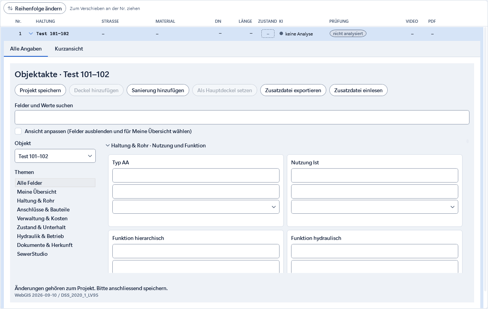
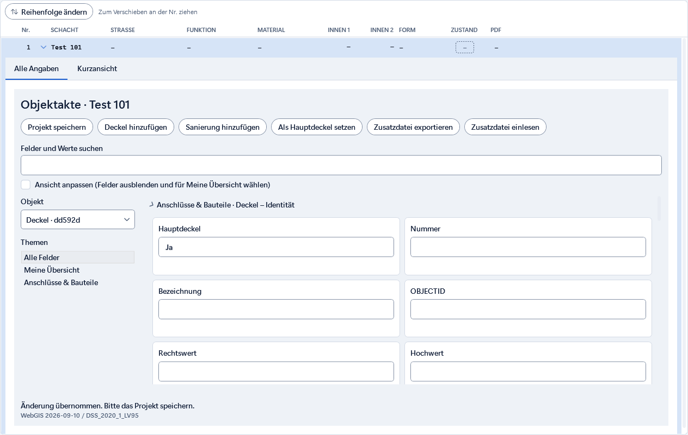
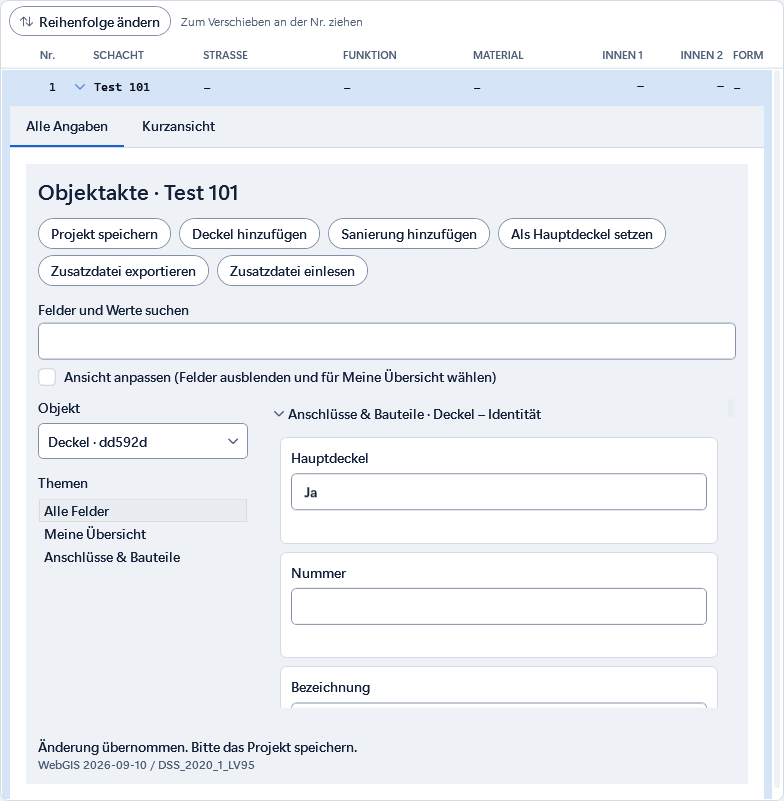

# Vollständige Felder direkt in der Aufklappliste

Stand: 11.09.2026.

Die erste Umsetzung hatte die vollständigen Felder nur im separaten Objektaktenfenster.
Die sichtbare Aufklappzeile zeigte weiterhin die bisherigen Karten. Diese Einbindung ist korrigiert.

In Haltungs- und Schachtlisten öffnet die Zeile nun standardmässig **Alle Angaben**.
Darin steht dieselbe vollständige Objektakte mit Themen, Suche, Deckeln und Sanierungen.
**Kurzansicht** behält die alten Karten, deren Anordnung und Live-Abgleich.
Farben, Karten und Schaltflächen verwenden weiterhin die Nova-Ressourcen.

Die automatische Speicherung wird auch bei Zusatzangaben aufgerufen. Das Öffnen allein
legt keine Akten an. Die letzte Eingabe wird vor einem Zeilenwechsel übernommen.
Gelöschte Datensätze und gewechselte Projekte sperren alte Bearbeitungsmodelle.

## Nachweise

- Dev-Release-Build: 0 Fehler, 0 Warnungen.
- Fokussierter UI-/Architekturlauf: 489 bestanden, 11 übersprungen, 0 Fehler.
  Die übersprungenen isolierten Kindtests laufen über ihre erfolgreichen Elternprüfungen.
- `ObjektakteAufklappTests` prüft mit echten Seiten-ViewModels beide Listen,
  letzte Eingabe beim Wechsel, Sucherhalt, Deckelerstellung/-auswahl, Hauptdeckel,
  Registerwechsel, schmale Darstellung und Löschen/Projektwechsel.
- Vorhandene Aufklapp-, Layout-, Objektakten- und Architekturprüfungen bestehen.
- Architektur-Skill validiert; betroffene Quelldateien ohne Whitespace-Fehler.
- Keine Änderung an Import-/Exportregeln oder am gespeicherten Projektformat in dieser Korrektur.

[Prüflog](nachweise/inline/ui-pruefung.txt)

