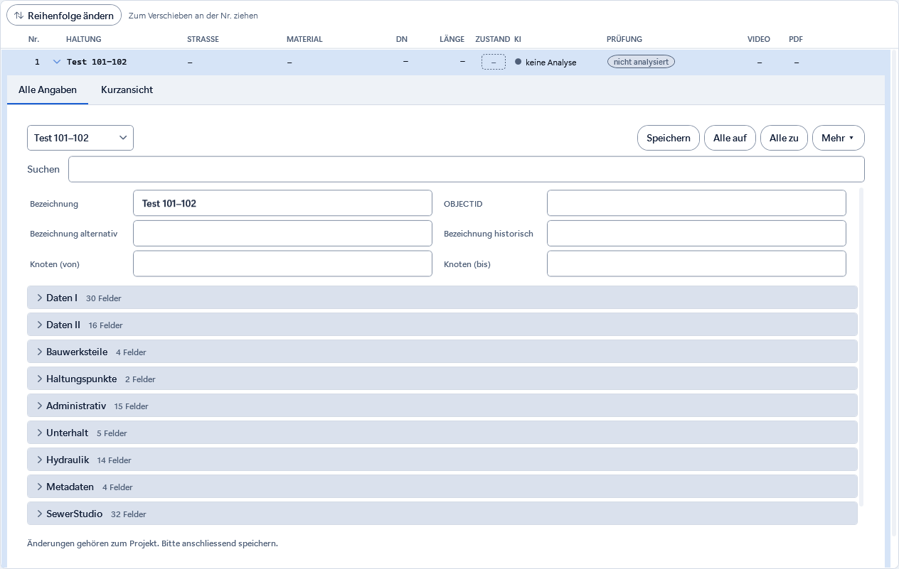
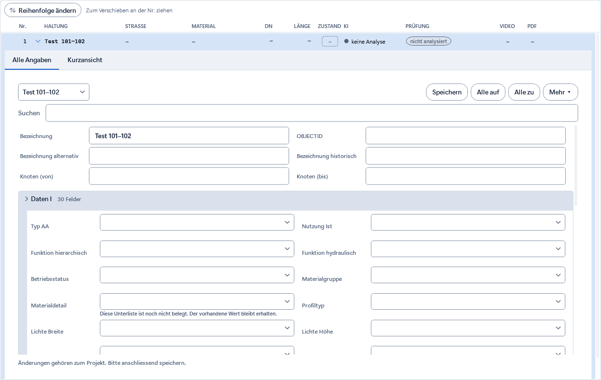
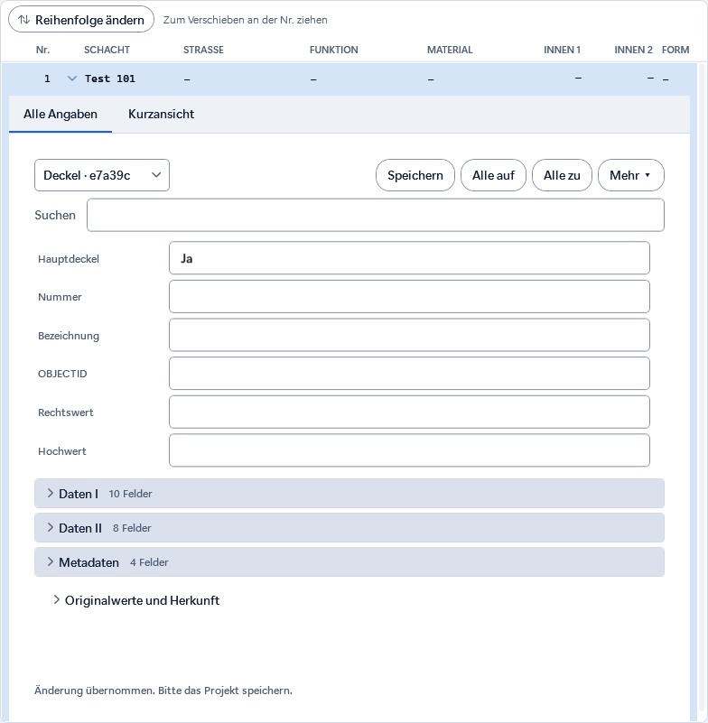

# Nova-Ansicht mit WebGIS-Anordnung

Stand 11.09.2026. Die vorige Themenleiste und Einzelkarten sind ersetzt durch Kopfangaben
und aufklappbare Bereichszeilen in der Reihenfolge des WebGIS. Nova-Farben und Bedienflächen bleiben.

Alle 200 Feldbezeichnungen wurden mit dem gespeicherten Plan verglichen und sind identisch.
Die Bereichszuordnung kommt direkt aus dessen Quellanzeigen. Zusatzfelder von SewerStudio bleiben erreichbar.

- Pro Feld nur eine sichtbare Eingabe; Auswahlcodes und freie Sonderwerte bleiben erhalten.
- Neue Bereiche zunächst zu; Suche öffnet passende Treffer. Alle auf/zu und persönliche Ausblendung bleiben möglich.
- Kopf und Eingaben passen sich an breite/schmale Fenster an.
- 494 Prüfungen bestanden, 11 isolierte Kindtests im Elternlauf übersprungen; ihre Elternprüfungen bestanden.
- Die Import-/Exportregeln und gespeicherten Daten wurden durch diesen Ansichtsumbau nicht geändert.

[Prüflog](nachweise/webgis-anordnung/pruefung.txt) · [Begriffsabgleich](nachweise/webgis-anordnung/begriffsabgleich.json)

